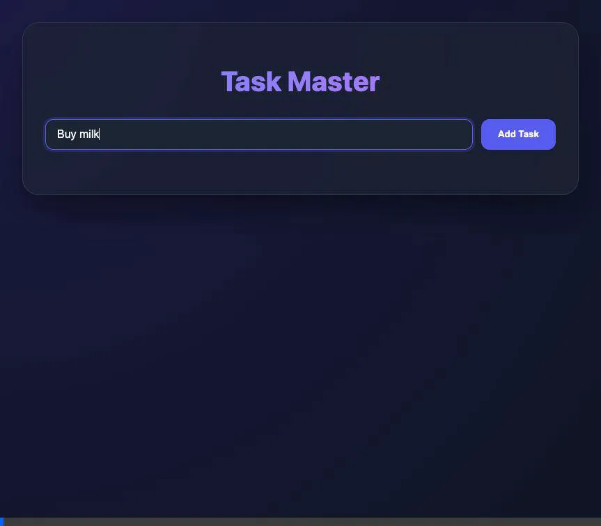
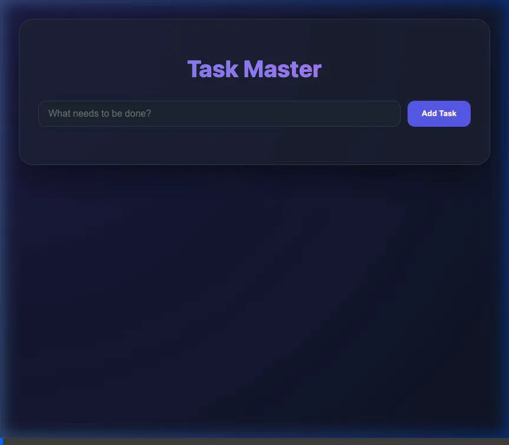

# プロジェクト・ウォークスルー - シンプルなTODOアプリ

React/Viteを使用したフロントエンドと、FastAPI（Python）を使用したバックエンドを組み合わせた、シンプルなTODOアプリケーションを構築しました。

## 実装された機能

- **タスクの追加**: リアルタイムにタスクを追加できます。
- **タスクの完了**: チェックボックスをクリックすることで、完了状態を切り替えられます（打ち消し線が表示されます）。
- **タスクの削除**: 「✕」ボタンをクリックしてタスクを削除できます。
- **データの永続化**: ローカルのSQLiteデータベース（`todos.db`）にデータが保存されます。
- **プレミアムなデザイン**: グラデーション、バックドロップフィルター（背景のぼかし）、スムーズなトランジションを採用したモダンなUIです。

## 検証結果

### ブラウザでのテスト

以下の手順で動作を確認しました：

1. 複数のタスク（「牛乳を買う」、「犬の散歩」）を追加。
2. タスクを完了状態に更新。
3. タスクを削除。
4. ReactとFastAPI間のAPI連携が正常であることを確認。

### E2Eテストの成功

Playwrightを使用した自動テストスイートも正常に実行されました：

- **堅牢なロケーター**: ロールベース（`listitem`）と固有の名前を組み合わせることで、既存データの影響を受けない安定したテストを実現。
- **カバレッジ**: タスクの追加・完了・削除の全フローを自動検証。

## プロジェクト構成

- `backend/`: FastAPIアプリケーション、データベースロジック、`uv`設定。
- `frontend/`: Reactアプリケーション（Vite）、コンポーネント、カスタムCSS。
- `docs/walkthrough.md`: このドキュメント。
- `operation_manual.md`: アプリケーションの実行手順書。
